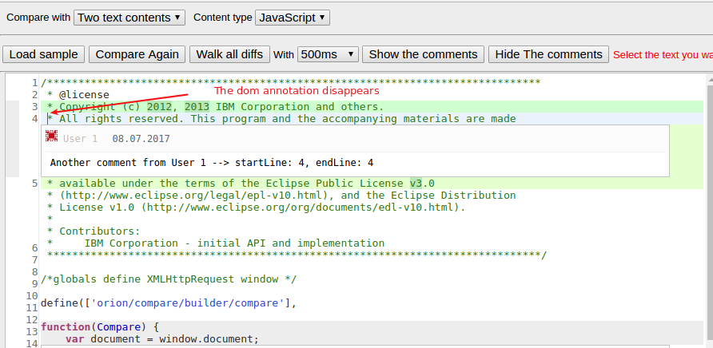

## HOW TO USE:

1. To run the demo, open the POC-demo-annotations.html file

2. The left and right content is loaded automatically.

3. The sample comments can be loaded and deleted with the "Show the comments" and "Hide the comments" buttons

4. On view switch (side bi side / inline) the comments must be loaded manually.

## DESCRIPTION OF THE PROBLEMS WITH DISPLAYING ANNOTATIONS IN DIFF-WIDGET:

1.

**Description:** Line number markings after initial insertion of annotations are wrong (see attached screenshot). After scrolling the viewport or positioning the cursor on some line the  line number markings get fixed to some degree, the dom annotation is marked with the line number which belongs to the line number right under the dom annotation (see other attached screenshot).

**Screenshot:**
Screenshot of orion editor directly after inserting comment annotations:

Screenshot of orion editor after scrolling down and up again or positioning the cursor on some line:

**How to reproduce:** Insert multiple dom element annotations into orion editor. You can use our POC-demo-annotations: click show comments, observe the line numbers. After that, scroll down and back up again. Observe line numbers again.  

**Expected result:** Line numbers should not be rendered next to the dom annotation. Line numbers right after the annotated lines should be rendered under the dom annotation, not next to it.

2.

**Description:** When two dom annotations are inserted one line after another, the gutter highlight is extended from-to that line, including the range of the dom annotation.

**Screenshot:**
Screenshot of two consecutive dom annotations:

**How to reproduce:** Insert two consecutive dom annotations, one line after another. For instance add dom annotations to lines 3 and 4. You can use our POC-demo-annotations: clich show comments, observe dom annotations and their respective gutter highlight. The gutter highlight is extended over the range of first dom annotation.

**Expected result:** Gutter highlight should not be visible over the range of the dom annotation.

3.

**Description:** Dom annotations disappear when positioning cursor one line above or below the dom annotation. However in this example it's not happening on dom annotation for the lines 17-18...

**Screenshot:**
Before, the cursor is above the dom annotation:

After:

**How to reproduce:** Insert a dom annotation, click on the annotated line, or the line below the dom annotation. The dom annotation disappears. If you scroll the dom annotation out and back into viewport, the annotation reappears. This can also be reproduced by showing all comments,  positioning the cursor on first line and then moving the cursor to the end of the file by holding the down arrow. All dom annotations disappear.

**Expected result:** DOM annotations should not disappear when cursor is positioned one line above or below the annotation.
